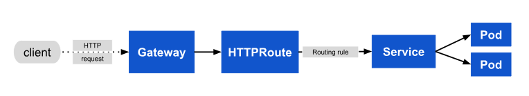

# GATEWAY API

Gateway API is an official Kubernetes project designed to address cluster ingress and internal routing needs.

Gateway API is a family of API kinds that provide dynamic infrastructure provisioning and advanced traffic routing.

## Why use Gateway API ? As we have ingress api already ???

- Ingress API supports simple HTTP/HTTPS routing but lacks features like header-based or query-parameter-based routing. Also it only offers limited support for UDP or gRPC

- Ingress API combines routing rules, load balancing, and backend configurations in a single resource. This tight coupling can cause management headaches, especially in large or multi-tenant setups. 

- The single API approach limits feedback and status reporting. Debugging misconfigurations or runtime behavior is challenging due to the lack of granular insights.

- Perhaps the most important reason to start using Gateway API instead of Ingress is that the Ingress API is officially frozen.(No new development is taking place)

- NO RBAC, No namespace isolation

- No native support for Header manipulation, Rate limiting, Middleware, CORS, Session Affinity etc (Allowed through annotations but not locally)

## How Gateway API Works ?

This is the flow of Gateway API

- Gateway Class

```yaml
apiVersion: gateway.networking.k8s.io/v1
kind: GatewayClass
metadata:
  name: example-class
spec:
  controllerName: example.com/gateway-controller
```

- Gateway

```yaml
apiVersion: gateway.networking.k8s.io/v1
kind: Gateway
metadata:
  name: example-gateway
spec:
  gatewayClassName: example-class
  listeners:
  - name: http
    protocol: HTTP
    port: 80
```

- Route (HTTP, TCP, GRPC)

```yaml
apiVersion: gateway.networking.k8s.io/v1
kind: HTTPRoute
metadata:
  name: example-httproute
spec:
  parentRefs:
  - name: example-gateway
  hostnames:
  - "www.example.com"
  rules:
  - matches:
    - path:
        type: PathPrefix
        value: /login
    backendRefs:
    - name: example-svc
      port: 8080
```

**Request Flow**



### References 

1. https://www.spectrocloud.com/blog/practical-guide-to-kubernetes-gateway-api

2. https://kubernetes.io/docs/concepts/services-networking/gateway/

